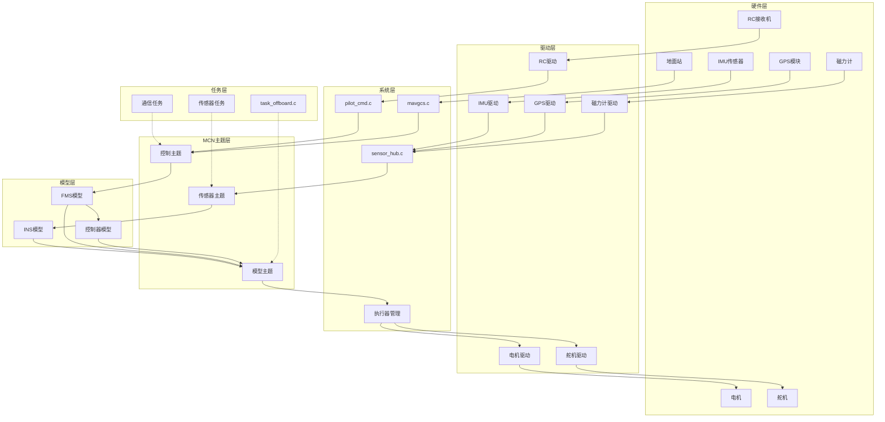
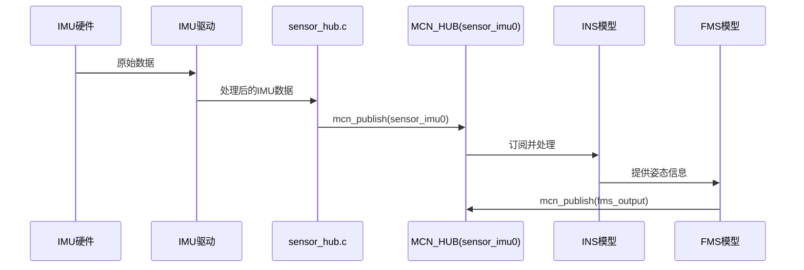
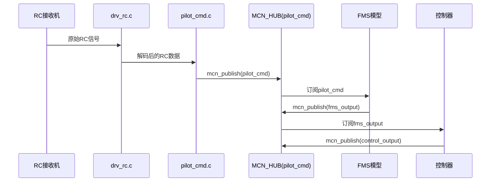
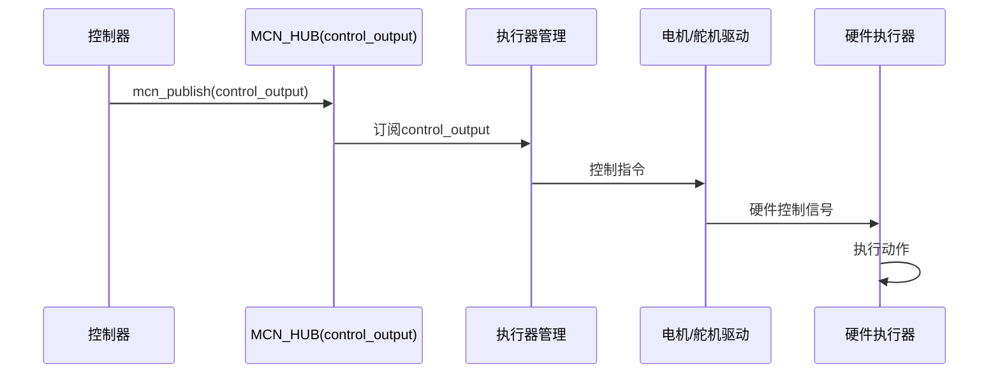

# ICF5 MCN数据流向图

## 概述

ICF5目标板使用MCN（Model Communication Network）作为模块间通信的核心机制。本文档详细描述了ICF5中MCN的数据流向、架构设计和关键组件。

## 目录

1. [MCN核心架构](#mcn核心架构)
2. [数据流向图](#数据流向图)
3. [关键组件详解](#关键组件详解)
4. [传感器数据流](#传感器数据流)
5. [控制数据流](#控制数据流)
6. [模型数据流](#模型数据流)
7. [执行器数据流](#执行器数据流)
8. [关键函数调用链](#关键函数调用链)
9. [ICF5特定配置](#icf5特定配置)

## MCN核心架构

### MCN Hub结构

```c
struct mcn_hub {
    const char* obj_name;        // 主题名称
    const uint32_t obj_size;     // 数据大小
    void* pdata;                 // 数据指针
    McnNode_t link_head;         // 订阅者链表头
    McnNode_t link_tail;         // 订阅者链表尾
    uint32_t link_num;           // 订阅者数量
    uint8_t published;           // 发布标志
    uint8_t suspend;             // 暂停标志
    rt_event_t event;            // 事件对象
    int (*echo)(void* parameter); // 回显函数
    float freq;                  // 发布频率
    uint16_t freq_est_window[MCN_FREQ_EST_WINDOW_LEN]; // 频率估计窗口
    uint16_t window_index;       // 窗口索引
};
```

### MCN节点结构

```c
struct mcn_node {
    McnHub_t hub;               // 关联的Hub
    volatile uint8_t renewal;   // 更新标志
    void (*pub_cb)(void* parameter); // 发布回调函数
    McnNode_t next;             // 下一个节点
};
```

## MCN发布和订阅数据流向图

### 1. 整体架构图



### 2. 任务订阅和发布详细图

```mermaid
graph TB
    %% 任务节点
    subgraph "ICF5任务层"
        TASK_OFFBOARD[task_offboard.c<br/>离线控制任务]
        TASK_STATUS[task_status.c<br/>状态监控任务]
        TASK_COMM[task_comm.c<br/>通信任务]
        TASK_LOGGER[task_logger.c<br/>日志任务]
        TASK_FMTIO[task_fmtio.c<br/>FMTIO任务]
        TASK_DRONECAN[task_dronecan.c<br/>DroneCAN任务]
        TASK_VEHICLE[task_vehicle.c<br/>车辆任务]
    end

    %% 模型层
    subgraph "模型层"
        INS[INS模型<br/>订阅: sensor_*<br/>发布: ins_output]
        FMS[FMS模型<br/>订阅: pilot_cmd, gcs_cmd<br/>发布: fms_output]
        CONTROLLER[控制器<br/>订阅: fms_output, ins_output<br/>发布: control_output]
        PLANT[Plant模型<br/>订阅: control_output<br/>发布: sensor_*, plant_states]
    end

    %% 系统模块
    subgraph "系统模块"
        PILOT_CMD[pilot_cmd.c<br/>订阅: rc_channels<br/>发布: pilot_cmd]
        SENSOR_HUB[sensor_hub.c<br/>发布: sensor_*]
        ACTUATOR_CMD[actuator_cmd.c<br/>订阅: control_output<br/>发布: 执行器控制]
        GCS_CMD[gcs_cmd.c<br/>订阅: fms_output<br/>发布: gcs_cmd]
        MISSION_DATA[mission_data.c<br/>订阅: fms_output, pilot_cmd, gcs_cmd<br/>发布: mission_data]
        POWER_MANAGE[power_manage.c<br/>发布: bat_status]
    end

    %% MCN主题
    subgraph "MCN主题"
        SENSOR_TOPICS[sensor_imu0, sensor_gps, sensor_mag0, sensor_baro]
        CONTROL_TOPICS[pilot_cmd, auto_cmd, gcs_cmd, mission_data]
        MODEL_TOPICS[ins_output, fms_output, control_output, plant_states]
        STATUS_TOPICS[bat_status, environment_info, states_init]
    end

    %% 连接关系 - 任务订阅
    TASK_OFFBOARD -.订阅.-> MODEL_TOPICS
    TASK_STATUS -.订阅.-> MODEL_TOPICS
    TASK_STATUS -.订阅.-> CONTROL_TOPICS
    TASK_COMM -.订阅.-> SENSOR_TOPICS
    TASK_COMM -.发布.-> CONTROL_TOPICS
    TASK_LOGGER -.订阅.-> MODEL_TOPICS
    TASK_LOGGER -.订阅.-> STATUS_TOPICS
    TASK_VEHICLE -.订阅.-> MODEL_TOPICS

    %% 连接关系 - 模型订阅
    INS -.订阅.-> SENSOR_TOPICS
    FMS -.订阅.-> CONTROL_TOPICS
    CONTROLLER -.订阅.-> MODEL_TOPICS
    PLANT -.订阅.-> MODEL_TOPICS

    %% 连接关系 - 系统模块
    PILOT_CMD -.订阅.-> SENSOR_TOPICS
    PILOT_CMD -.发布.-> CONTROL_TOPICS
    SENSOR_HUB -.发布.-> SENSOR_TOPICS
    ACTUATOR_CMD -.订阅.-> MODEL_TOPICS
    GCS_CMD -.订阅.-> MODEL_TOPICS
    GCS_CMD -.发布.-> CONTROL_TOPICS
    MISSION_DATA -.订阅.-> MODEL_TOPICS
    MISSION_DATA -.订阅.-> CONTROL_TOPICS
    MISSION_DATA -.发布.-> CONTROL_TOPICS
    POWER_MANAGE -.发布.-> STATUS_TOPICS
```



### 3. 数据流时序图

#### 传感器数据流


#### 遥控器数据流


#### 执行器控制流


### 详细任务数据订阅和发布表

| 任务名称 | 订阅的数据 | 发布的数据 | 主要功能 |
|---------|-----------|-----------|----------|
| **task_offboard.c** | `fms_output`, `ins_output` | `auto_cmd` | 离线控制，生成自动飞行指令 |
| **task_status.c** | `fms_output`, `ins_output`, `pilot_cmd`, `mission_data` | 无 | 状态监控和显示 |
| **task_comm.c** | `sensor_*`, `ins_output`, `fms_output` | `pilot_cmd`, `gcs_cmd`, `mission_data` | 通信管理，地面站交互 |
| **task_logger.c** | `ins_output`, `fms_output`, `control_output`, `bat_status` | 无 | 数据记录和日志 |
| **task_fmtio.c** | 无 | 无 | FMTIO接口管理 |
| **task_dronecan.c** | 无 | 无 | DroneCAN协议管理 |
| **task_vehicle.c** | `ins_output`, `fms_output`, `control_output` | 无 | 车辆状态管理 |

### 模型层数据订阅和发布

| 模型名称 | 订阅的数据 | 发布的数据 | 主要功能 |
|---------|-----------|-----------|----------|
| **INS模型** | `sensor_imu0`, `sensor_mag0`, `sensor_baro`, `sensor_gps` | `ins_output` | 惯性导航，姿态解算 |
| **FMS模型** | `pilot_cmd`, `gcs_cmd`, `auto_cmd`, `mission_data`, `ins_output` | `fms_output` | 飞行模式管理 |
| **控制器** | `fms_output`, `ins_output` | `control_output` | 控制算法，执行器指令 |
| **Plant模型** | `control_output` | `sensor_*`, `plant_states` | 仿真环境，传感器模拟 |

### 系统模块数据订阅和发布

| 模块名称 | 订阅的数据 | 发布的数据 | 主要功能 |
|---------|-----------|-----------|----------|
| **pilot_cmd.c** | `rc_channels` | `pilot_cmd`, `rc_channels`, `rc_trim_channels` | RC遥控器处理 |
| **sensor_hub.c** | 无 | `sensor_imu0`, `sensor_gps`, `sensor_mag0`, `sensor_baro` | 传感器数据管理 |
| **actuator_cmd.c** | `control_output`, `rc_trim_channels` | 执行器控制信号 | 执行器控制 |
| **gcs_cmd.c** | `fms_output` | `gcs_cmd` | 地面站命令处理 |
| **mission_data.c** | `fms_output`, `pilot_cmd`, `gcs_cmd` | `mission_data` | 任务数据管理 |
| **power_manage.c** | 无 | `bat_status` | 电源管理 |

## 关键组件详解

### 1. 传感器数据流


### 2. 遥控器数据流


### 3. 执行器控制流


## 传感器数据流

### IMU数据流

```c
// 1. 硬件读取
IMU硬件 → imu驱动 → sensor_hub.c

// 2. MCN发布
mcn_publish(MCN_HUB(sensor_imu0), &imu_data);

// 3. 模型订阅
INS模型订阅 sensor_imu0 → 处理姿态解算
```

### GPS数据流

```c
// 1. 硬件读取
GPS硬件 → gps驱动 → sensor_hub.c

// 2. MCN发布
mcn_publish(MCN_HUB(sensor_gps), &gps_data);

// 3. 模型订阅
INS模型订阅 sensor_gps → 位置融合
```

### 磁力计数据流

```c
// 1. 硬件读取
磁力计硬件 → mag驱动 → sensor_hub.c

// 2. MCN发布
mcn_publish(MCN_HUB(sensor_mag0), &mag_data);

// 3. 模型订阅
INS模型订阅 sensor_mag0 → 航向解算
```

## 控制数据流

### RC遥控数据流

```c
// 1. RC硬件输入
RC接收机 → drv_rc.c → rc.c → pilot_cmd.c

// 2. MCN发布
mcn_publish(MCN_HUB(rc_channels), rcChannel);
mcn_publish(MCN_HUB(rc_trim_channels), rcTrimChannel);
mcn_publish(MCN_HUB(pilot_cmd), &pilot_cmd_bus);

// 3. 模型订阅
FMS模型订阅 pilot_cmd → 生成 fms_output
```

### 地面站命令流

```c
// 1. 地面站输入
地面站 → mavgcs.c → gcs_cmd.c

// 2. MCN发布
mcn_publish(MCN_HUB(gcs_cmd), &gcs_cmd);

// 3. 模型订阅
FMS模型订阅 gcs_cmd → 处理地面站命令
```

## 模型数据流

### INS输出流

```c
// 1. INS模型处理
INS模型 → 姿态解算 → 位置融合

// 2. MCN发布
mcn_publish(MCN_HUB(ins_output), &ins_out);

// 3. 其他模型订阅
FMS模型订阅 ins_output → 状态估计
控制器订阅 ins_output → 反馈控制
```

### FMS输出流

```c
// 1. FMS模型处理
FMS模型 → 飞行模式管理 → 命令处理

// 2. MCN发布
mcn_publish(MCN_HUB(fms_output), &fms_out);

// 3. 控制器订阅
控制器订阅 fms_output → 控制指令生成
```

### 控制器输出流

```c
// 1. 控制器处理
控制器 → 控制算法 → 执行器指令

// 2. MCN发布
mcn_publish(MCN_HUB(control_output), &control_out);

// 3. 执行器订阅
执行器管理订阅 control_output → 硬件控制
```

## 执行器数据流

### 电机控制流

```c
// 1. 控制器输出
控制器 → MCN_HUB(control_output) → 执行器管理

// 2. 电机驱动
执行器管理 → 电机驱动 → 电机硬件

// 3. 反馈控制
电机状态 → 传感器 → MCN → 控制器
```

### 舵机控制流

```c
// 1. 控制器输出
控制器 → MCN_HUB(control_output) → 执行器管理

// 2. 舵机驱动
执行器管理 → 舵机驱动 → 舵机硬件

// 3. 反馈控制
舵机状态 → 传感器 → MCN → 控制器
```

## 关键函数调用链

### 发布流程

```c
// 1. 数据准备
imu_data_t imu_data = {
    .timestamp = systime_now_ms(),
    .gyro_x = gyro_x,
    .gyro_y = gyro_y,
    .gyro_z = gyro_z,
    .accel_x = accel_x,
    .accel_y = accel_y,
    .accel_z = accel_z
};

// 2. MCN发布
mcn_publish(MCN_HUB(sensor_imu0), &imu_data);

// 3. 内部处理
- 复制数据到hub->pdata
- 更新所有订阅者的renewal标志
- 调用订阅者的回调函数
- 发送事件唤醒等待的任务
```

### 订阅流程

```c
// 1. 订阅主题
McnNode_t node = mcn_subscribe(MCN_HUB(sensor_imu0), callback);

// 2. 等待数据
if (mcn_wait(node, timeout)) {
    // 3. 复制数据
    mcn_copy(MCN_HUB(sensor_imu0), node, &imu_data);
    
    // 4. 处理数据
    process_imu_data(&imu_data);
}
```

### 数据同步流程

```c
// 1. 多任务同步
Task1: mcn_publish(MCN_HUB(sensor_imu0), &imu_data);
Task2: mcn_wait(node, RT_WAITING_FOREVER);
Task2: mcn_copy(MCN_HUB(sensor_imu0), node, &imu_data);

// 2. 事件驱动
- 发布时发送事件
- 订阅者等待事件
- 事件唤醒订阅者
```

## ICF5特定配置

### 主要MCN主题定义

```c
// 传感器主题
MCN_DEFINE(sensor_imu0, sizeof(imu_data_t));
MCN_DEFINE(sensor_mag0, sizeof(mag_data_t));
MCN_DEFINE(sensor_baro, sizeof(baro_data_t));
MCN_DEFINE(sensor_gps, sizeof(gps_data_t));

// 控制主题
MCN_DEFINE(pilot_cmd, sizeof(Pilot_Cmd_Bus));
MCN_DEFINE(auto_cmd, sizeof(Auto_Cmd_Bus));
MCN_DEFINE(gcs_cmd, sizeof(GCS_Cmd_Bus));

// 模型输出主题
MCN_DEFINE(ins_output, sizeof(INS_Out_Bus));
MCN_DEFINE(fms_output, sizeof(FMS_Out_Bus));
MCN_DEFINE(control_output, sizeof(Control_Out_Bus));
```

### 任务配置

```c
// task_offboard.c 中的MCN使用
MCN_DECLARE(auto_cmd);
MCN_DECLARE(fms_output);
MCN_DECLARE(ins_output);

// 订阅
fms_out_nod = mcn_subscribe(MCN_HUB(fms_output), NULL);
ins_out_nod = mcn_subscribe(MCN_HUB(ins_output), NULL);

// 发布
mcn_publish(MCN_HUB(auto_cmd), &auto_cmd);
```

### 初始化流程

```c
// 1. MCN系统初始化
mcn_init();

// 2. 主题发布
mcn_advertise(MCN_HUB(sensor_imu0), echo_imu);
mcn_advertise(MCN_HUB(pilot_cmd), echo_pilot_cmd);

// 3. 任务订阅
sensor_task: mcn_subscribe(MCN_HUB(sensor_imu0), NULL);
control_task: mcn_subscribe(MCN_HUB(pilot_cmd), NULL);
```

## 总结

ICF5的MCN架构提供了：

1. **松耦合设计**：各模块通过MCN主题进行通信，降低模块间依赖
2. **实时性能**：支持事件驱动的实时数据交换
3. **可扩展性**：易于添加新的传感器、控制器和执行器
4. **可靠性**：提供数据同步和错误处理机制
5. **调试友好**：支持数据回显和频率监控

这种架构确保了ICF5目标板中各个模块之间的高效通信，支持复杂的飞行控制系统需求。 