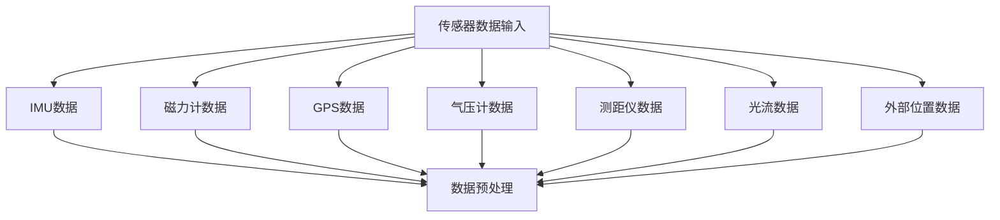
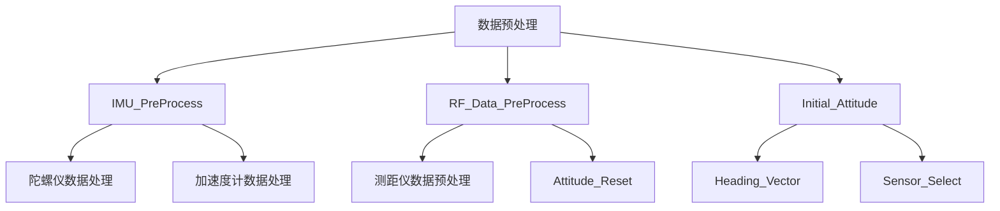
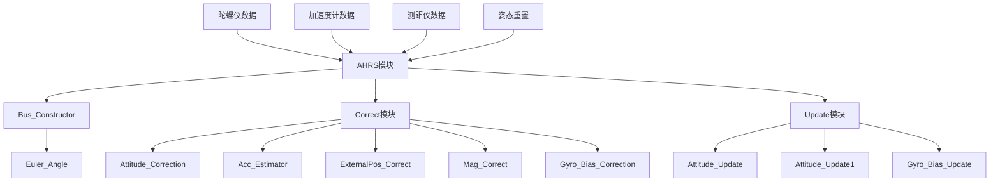
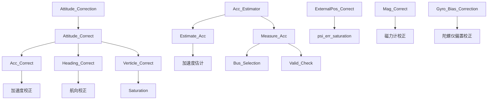
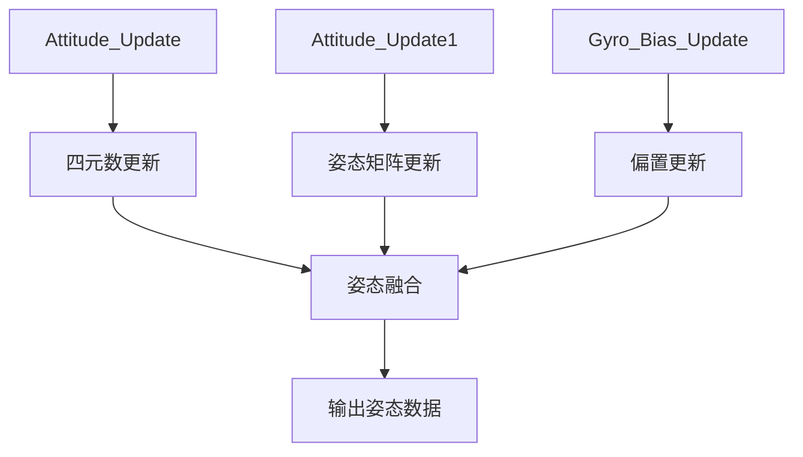

# Rotation Filter 模块流程图

## 概述

Rotation Filter 是 INS (惯性导航系统) 中的核心模块，主要负责姿态估计和融合。该模块基于 AHRS (姿态航向参考系统) 算法，通过融合多种传感器数据来提供准确的姿态信息。

## 模块结构

根据模型浏览图，Rotation Filter 模块包含以下主要组件：

```
Data_Fusion
├── Rotation_Filter
    ├── AHRS
        ├── Bus_Constructor
        │   └── Euler_Angle
        ├── Correct
        │   ├── Attitude_Correction
        │   │   ├── Attitude_Correct
        │   │   │   ├── Acc_Correct
        │   │   │   │   ├── Heading_Correct
        │   │   │   │   └── Verticle_Correct
        │   │   │   │       └── Saturation
        │   │   ├── Acc_Estimator
        │   │   │   ├── Estimate_Acc
        │   │   │   └── Measure_Acc
        │   │   │       ├── Bus_Selection
        │   │   │       └── Valid_Check
        │   │   ├── ExternalPos_Correct
        │   │   │   └── psi_err_saturation
        │   │   ├── Mag_Correct (折叠)
        │   │   └── Gyro_Bias_Correction
        │   └── Update
        │       ├── Attitude_Update (当前选中)
        │       ├── Attitude_Update1
        │       └── Gyro_Bias_Update
    ├── RF_Data_PreProcess
    │   └── Attitude_Reset
    │       ├── GPS_Heading_Reset
    │       ├── sample_valid
    │       └── sample_valid1
    ├── Initial_Attitude
    │   ├── Heading_Vector
    │   └── Sensor_Select
    └── Standstill
```

## 详细流程图

### 1. 数据输入层



### 2. 数据预处理层



### 3. AHRS 核心处理层



### 4. 姿态校正详细流程



### 5. 姿态更新流程



## 关键算法说明

### 1. AHRS 算法
- **功能**: 姿态航向参考系统，融合陀螺仪、加速度计和磁力计数据
- **核心**: 互补滤波器，结合高频陀螺仪数据和低频加速度计/磁力计数据
- **输出**: 四元数表示的姿态

### 2. 姿态校正算法
- **Acc_Correct**: 基于重力矢量的俯仰和横滚校正
- **Heading_Correct**: 基于磁力计的航向校正
- **Verticle_Correct**: 垂直方向校正，包含饱和限制

### 3. 传感器融合策略
- **GPS融合**: 位置和速度信息融合
- **气压计融合**: 高度信息融合
- **测距仪融合**: 近距离高度测量
- **光流融合**: 速度信息融合
- **外部位置融合**: 外部提供的姿态/位置信息

## 参数配置

根据代码分析，主要参数包括：

```c
// 姿态校正增益
ATT_GAIN = 0.2f;           // 姿态校正增益
HEADING_GAIN = 0.05f;       // 航向校正增益
MAG_GAIN = 0.3f;           // 磁力计校正增益
BIAS_G_GAIN = 0.25f;       // 陀螺仪偏置校正增益

// GPS融合参数
GPS_POS_GAIN = 0.05f;      // GPS位置增益
GPS_VEL_GAIN = 2.0f;       // GPS速度增益
GPS_ALT_GAIN = 0.0f;       // GPS高度增益

// 其他传感器融合参数
BARO_H_GAIN = 2.0f;        // 气压计高度增益
RF_H_GAIN = 3.0f;          // 测距仪高度增益
OPF_VEL_GAIN = 2.0f;       // 光流速度增益
```

## 数据流时序

1. **传感器数据采集** (1kHz)
   - IMU数据: 陀螺仪、加速度计
   - 辅助传感器: 磁力计、GPS、气压计等

2. **数据预处理** (1kHz)
   - 传感器校准和滤波
   - 数据有效性检查
   - 坐标系转换

3. **AHRS处理** (1kHz)
   - 姿态预测 (陀螺仪积分)
   - 姿态校正 (传感器融合)
   - 偏置估计和校正

4. **输出更新** (1kHz)
   - 姿态四元数
   - 欧拉角 (俯仰、横滚、航向)
   - 角速度和线速度
   - 位置和高度信息

## 性能特点

- **实时性**: 1kHz 处理频率，满足飞行控制需求
- **精度**: 通过多传感器融合提高姿态估计精度
- **鲁棒性**: 具备传感器故障检测和容错能力
- **适应性**: 支持不同传感器配置和飞行模式

## 故障处理

1. **传感器失效检测**
   - 数据有效性检查
   - 异常值检测和过滤

2. **降级模式**
   - 单传感器模式
   - 传感器切换机制

3. **安全保护**
   - 姿态角限制
   - 数据饱和保护
   - 异常状态处理

## 总结

Rotation Filter 模块是 INS 系统的核心组件，通过 AHRS 算法实现了高精度的姿态估计。该模块采用分层设计，从数据预处理到姿态融合，每个环节都经过精心优化，确保了系统的实时性、精度和鲁棒性。通过多传感器融合策略，系统能够在各种飞行条件下提供可靠的姿态信息。 