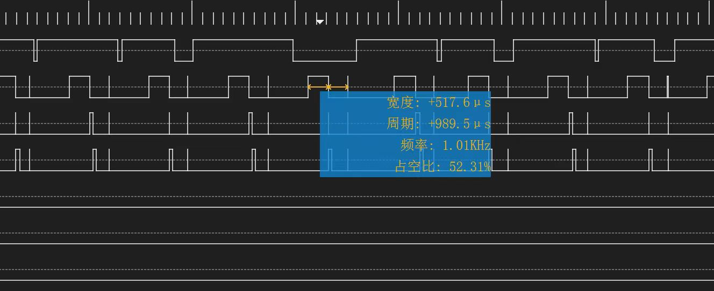
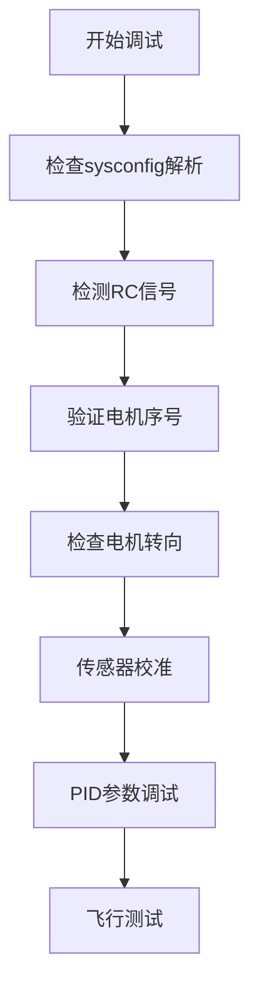

1. 可以飞行的commit号如下：

# FMU-V2 Q250 飞行测试记录

## 📋 版本信息

### ✅ 可飞行版本

**Commit ID**: `3c1d8967a28c9710d81f507f8a99d3eff61b1e5d`

---

## 🔧 修改记录

### 主要修改项

1. **内存优化**

   - 主线版本在TOML解析过程中出现RAM不足问题
   - 删减mlog缓冲区大小，减少BSS段RAM占用
2. **通信模块优化**

   - 移除comm任务中与机载电脑的通信功能
3. **编译配置**

   - 切换为Debug模式编译
4. **硬件配置调整**

   - 去除FMU-V2的AUX-PWM功能
   - ⚠️ **重要**: 必须在sysconfig文件中移除AUX PWM相关配置
5. **性能监控**

   - 新增DebugPin功能，用于监控任务执行时间
   - 监控对象：Vehicle任务、Comm任务
   - **测试结果**: INS执行耗时约518μs，各执行周期与MCN保持一致

### 性能测试结果



---

## 🛠️ 调试指南

### 1. 辅助MCU固件烧录

```bash
# 步骤说明
1. 给辅助MCU刷入PX4 bootloader固件
2. 将FMT的IO bin文件复制到SD卡
3. 使用命令升级辅助MCU固件
   fmtio update
4. 验证通信是否正常
   fmtio hello
```

### 2. SD卡兼容性

- ⚠️ **注意**: 某些SD卡可能不兼容，需要选择适配的SD卡
- 同一张SD卡在不同飞控板上可能表现不同

### 3. QGroundControl连接问题

- 如果QGC连接异常，建议关闭console和mavlink的自动切换功能

### 4. 系统状态检查


| 检查项目      | 正常状态         | 说明             |
| ------------- | ---------------- | ---------------- |
| sysconfig解析 | main out ref = 1 | PWM输出正常      |
| RC遥控器      | 信号稳定         | 检查接收机连接   |
| 电机序号      | 按标准映射       | 确认电机编号正确 |
| 电机转向      | 符合机架类型     | 检查螺旋桨方向   |

### 5. 调试流程



### 6. 标准调试顺序

1. **系统配置检查**

   - 验证sysconfig文件解析正常
   - 确认PWM输出功能
2. **遥控器测试**

   - 检查RC信号接收
   - 验证通道映射
3. **动力系统验证**

   - 确认电机序号正确
   - 检查电机转向符合机架要求
4. **传感器校准**

   - 陀螺仪校准
   - 加速度计校准
   - 磁力计校准
   - 气压计校准
5. **控制参数调优**

   - 调试姿态环PID
   - 调试位置环PID
   - 测试响应特性

---

## ⚠️ 重要提醒

- **内存限制**: 当前版本对RAM使用较为敏感，避免同时开启过多功能
- **配置一致性**: 硬件配置必须与软件配置保持一致
- **调试顺序**: 严格按照调试流程进行，避免跳步骤
- **安全第一**: 所有地面测试完成后再进行飞行测试

---

*最后更新时间: 2025年8月2日*
